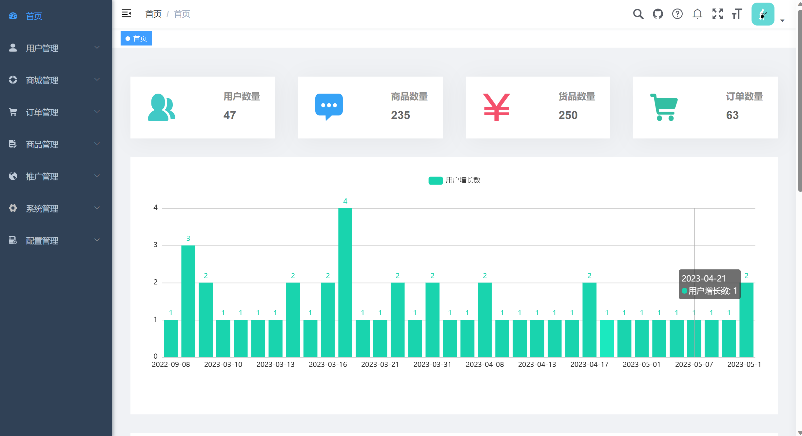
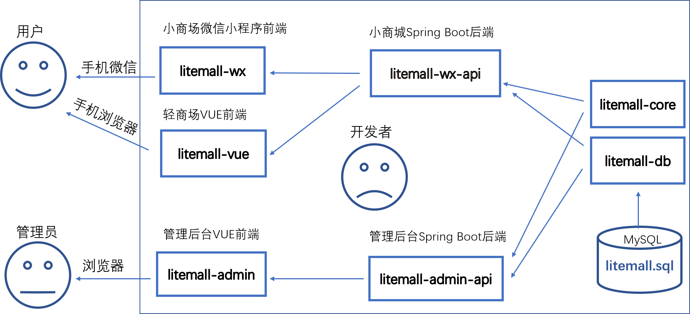
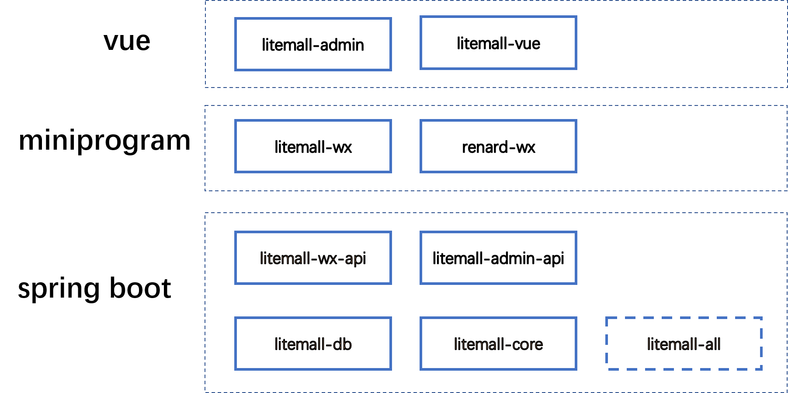
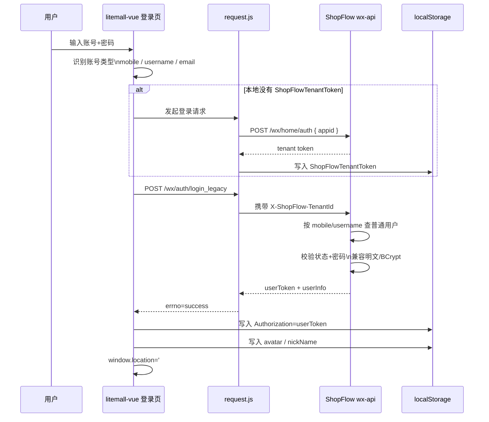

# ShopFlow

对【shopflow 】的全面优化，原shopflow主要面向单体商户（B2C模式）
经改良后shopflow则是（平台管理员->小程序店铺->用户）（可单体，可SaaS模式）
SaaS平台请进群资讯群主

## 项目实例

#### 1.微信小程序演示
* 其主要依赖于[colorui](http://docs.xzeu.com/#/info/%E5%BF%AB%E9%80%9F%E5%BC%80%E5%A7%8B/%E5%BF%AB%E9%80%9F%E5%B8%83%E7%BD%B2) ，目前小程序前端ui优化基本完成，大家可自行扫码阅览
* 微信小程序商城演示
* （收费版）测试账号：18585675204 验证码：567890
* （免费版）无演示地址

| 邻达同城                                                   |
|--------------------------------------------------------|
|  |

### 2.管理后台演示

| 管理后台首页                                                |
|-------------------------------------------------------|
|  |

1. 浏览器打开，输入以下网址: [https://manager.enshipeixue.com/](https://manager.enshipeixue.com/)
2. 登录密码  用户名：`admin123`，管理员密码：`admin123`
> 注意：此实例只是测试管理后台。

### 系统功能

|       | 功能     | 描述                                             |
|-------|--------|------------------------------------------------|
| 🚀    | 用户管理   | 用户是小程序用户，可对用户账号进行禁用，注销等操作                      |
| 🚀    | 广告管理   | 用于按需投放自定义广告，可自定义跳转                             |
| 🚀    | 专题管理   | 以文章形式推广商品内置百度富文本组件，文章+商品模式                     |
| 🚀    | 团购管理   | 商品推广活动，可自定义团购                                  |
| 🚀    | 赏金管理   | 可将商品以分享形式发给其他用户赚取提成                            |
| 🚀    | 分享管理   | 类似分销模式，用户分享推广小程序，用户下单后赚取提成                     |
| 🚀    | 动态管理   | 类似社区，朋友圈，用户可自行发布内容                             |
| 🚀    | 优惠券管理  | 可自定义发放优惠券，可用于抵扣商品                              |
| 🚀    | 帮助中心   | 类似与用户协议与须知（小程序中）                               |
| 🚀    | 微信支付   | 使用官方sdk对接微信支付 ，退款 ，转账                          |
| 🚀    | 积分管理   | 用户可用积分购买商品，或出售商品获得积分，积分可提现                     |
| 🚀    | 物流管理   | 内置菜鸟物流，微信物流组件（免费），两种模式                         |
| 🚀    | 百度内容审核 | 对用户上传内容进行非法审核，如色情，暴力等（可关闭全局审核会影响接口响应速度）        |
| 🚀    | 对象存储   | 内置四种文件存储管理，本地存储，腾讯对象存储，阿里对象存储管理，千牛对象存储         |
| 🚀    | AI对话   | 对接公益ChatGPT3.5（免费，无需外网）与官方ChatGPT3.5接口（收费，要外网） |
| 🚀    | 聊天功能   | 聊天工具，用于线上沟通                                    |
| 🚀    | 多店铺    | 用户可自行在小程序内创建店铺并出售商品（商品需审核，店铺不用）                |
| 🚀    | 角色管理   | 角色菜单权限分配、设置角色进行数据范围权限划分                        |
| 🚀    | 权限管理   | 基于satoken实现权限管理，与接口校验                          |
| 🚀    | 租户管理   | 配置系统租户，支持 SaaS 场景下的多租户功能 ，可同时运营多个小程序           |
| 🚀    | 短信服务   | 短信渠道、短息模板、对接阿里云、腾讯云等主流短信平台                     |
| 🚀    | 邮件管理   | 邮箱账号、邮件模版、邮件发送日志，支持所有邮件平台                      |
| 🚀    | 操作日志   | 系统正常操作日志记录和查询                                  |
| 🚀    | 系统日志   | 代码运行日志实时监控                                     |
| 🚀    | 通知公告   | 系统通知公告信息发布维护                                   |
| 🚀    | 地区管理   | 展示省份、城市、区镇等城市信息，支持 IP 对应城市                     |

### 基础设施

|    | 功能   | 描述                                           |
|----|------|----------------------------------------------|
| 🚀 | 系统接口 | 基于 smart-doc生成 API 接口文档   （基于注释生成文档）         |
| 🚀  | 表单构建 | 拖动表单元素生成相应的 HTML 代码，支持导出 JSON、Vue 文件         |
| 🚀 | 配置管理 | 对系统动态配置常用参数，                                 |
| 🚀 | 数据库自动备份 | 每小时对数据库进行备份                                  |
| 🚀 | 动态数据源 | 基于mybatis-plus实现，可对每个租户自定义数据库                |
| 🚀 | 乐观锁  | 基于mybatis-plus实现，可防止数据不一致                    |
| 🚀 | 分布式ID | 自定义sql拦截器实现自定义，雪花ID生成器                       |
| 🚀 | 代码生成 | 优化mybatis-plus代码生成, 添加自定义数据库类型与Java数据类型映射    |
| 🚀 | 延时任务 | 基于redis实现延时任务（处理订单支付超时）                      |
| 🚀  | MySQL 监控 | 监视当前系统数据库连接池状态，可进行分析SQL找出系统性能瓶颈              |
| 🚀 | 消息队列 | 基于 Redis 实现消息队列，Stream 提供集群消费，Pub/Sub 提供广播消费 |
| 🚀 | Java 监控 | 基于 Spring Boot Admin 实现 Java 应用的监控           |
| 🚀 | 分布式锁 | 基于 Redis 实现分布式锁，满足并发场景                       |
| 🚀 | 接口限流 | 基于 Redis 实现接口限流，解决重复请求问题                     |
| 🚀 | 日志服务 | 轻量级日志中心，查看远程服务器的日志                           |

## 项目文档

* [wx-API接口文档](https://manager.enshipeixue.com/wx-doc/index.html)
* [admin-API接口文档](https://manager.enshipeixue.com/admin-doc/index.html)
* [数据库](./doc/database.md)
* [常见问题FAQ](./doc/FAQ.md)
* [1. 系统架构](./doc/project.md)
* [3. 微信小程序](./doc/wxmall.md)
* [4. 管理后台](./doc/admin.md)


## 项目架构


Spring Boot后端 + Vue管理员前端 + 微信小程序用户前端 + Vue用户移动端

## 技术栈

> 1. Spring Boot
> 2. Vue
> 3. 微信小程序



## 快速启动

1. 配置最小开发环境：
    * [MySQL](https://dev.mysql.com/downloads/mysql/)
    * [JDK1.8或以上](http://www.oracle.com/technetwork/java/javase/overview/index.html)
    * [Maven](https://maven.apache.org/download.cgi)
    * [Nodejs](https://nodejs.org/en/download/)
    * [微信开发者工具](https://developers.weixin.qq.com/miniprogram/dev/devtools/download.html)
    
2. 数据库直接导入shopflow-db/sql下的数据库文件
    * shopflow.sql

3. 启动小商场和管理后台的后端服务

    打开命令行，输入以下命令
    ```bash
    cd shopflow
    mvn install
    mvn clean package
    java -Dfile.encoding=UTF-8 -jar shopflow-all/target/shopflow-all-0.1.0-exec.jar
    ```
    
4. 启动管理后台前端

    打开命令行，输入以下命令
    ```bash
    npm config set registry http://registry.npm.taobao.org
    cd shopflow/shopflow-admin
    npm install
    npm run dev
    ```
    此时，浏览器打开，输入网址`http://localhost:9527`, 此时进入管理后台登录页面。

   注意：
   > 这里只是最简启动方式，而微信登录、微信支付等功能需开发者设置才能运行，
   > 更详细方案请参考[文档](./doc/project.md)。

## H5 登录流程留存

当前仓库里的 `litemall-vue` 前台 H5，登录链路已经对齐到 ShopFlow 的 `wx-api` 普通用户登录体系，整体流程如下：



补充说明：

1. 前台登录接口不是后台管理员登录，而是普通用户 H5 兼容登录接口：`POST /wx/auth/login_legacy`。
2. 登录前会自动做一次租户预热，请求 `POST /wx/home/auth`，并把返回值缓存到 `localStorage.ShopFlowTenantToken`。
3. 正式登录请求会携带 `X-ShopFlow-TenantId` 请求头；登录成功后会把 `userToken` 落到 `localStorage.Authorization`。
4. 路由守卫只看 `Authorization`，访问 `/user` 等 `meta.login = true` 页面时，没有本地登录态就会跳回 `/login`。
5. 当前 `login_legacy` 支持手机号和用户名登录；邮箱登录明确不支持。
6. 后端密码校验兼容历史明文密码和当前 BCrypt 密码。

相关关键入口：

- 前台登录页：`litemall-vue/src/views/login/login.vue`
- 前台请求拦截：`litemall-vue/src/utils/request.js`
- 前台兼容层：`litemall-vue/src/utils/shopflow-compat.js`
- 前台 API 映射：`litemall-vue/src/api/api.js`
- 后端登录控制器：`shopflow-wx-api/src/main/java/org/ysling/shopflow/wx/web/WxAuthController.java`
- 后端登录实现：`shopflow-wx-api/src/main/java/org/ysling/shopflow/wx/web/impl/WxWebAuthService.java`
- 后端兼容工具：`shopflow-wx-api/src/main/java/org/ysling/shopflow/wx/support/LegacyH5AuthSupport.java`

### 致谢

| 框架                                                                                                                | 说明                                 | 版本         | 学习指南                                                           |
|-------------------------------------------------------------------------------------------------------------------|------------------------------------|------------|----------------------------------------------------------------|
| [ShopFlow](https://gitee.com/linlinjava/shopflow) | 该项目的基础架构                           |      |
| [colorui](http://docs.xzeu.com/#/info/%E5%BF%AB%E9%80%9F%E5%BC%80%E5%A7%8B/%E5%BF%AB%E9%80%9F%E5%B8%83%E7%BD%B2)  | ColorUI是一个css库！！！在你引入样式后可以根据class来调用组件。 |      | 
| [satoken](https://sa-token.cc/index.html)                                                                         | 一个轻量级 java 权限认证框架，让鉴权变得简单、优雅！      | 1.34.0     | -                                                              |
| [Spring Boot](https://spring.io/projects/spring-boot)                                                             | 应用开发框架                             | 2.7.8      | [文档](https://github.com/YunaiV/SpringBoot-Labs)                |
| [MySQL](https://www.mysql.com/cn/)                                                                                | 数据库服务器                             | 5.7 / 8.0+ |                                                                |
| [Druid](https://github.com/alibaba/druid)                                                                         | JDBC 连接池、监控组件                      | 1.2.15     | [文档](http://www.iocoder.cn/Spring-Boot/datasource-pool/?yudao) |
| [MyBatis Plus](https://mp.baomidou.com/)                                                                          | MyBatis 增强工具包                      | 3.5.3.1    | [文档](http://www.iocoder.cn/Spring-Boot/MyBatis/?yudao)         |
| [Dynamic Datasource](https://dynamic-datasource.com/)                                                             | 动态数据源                              | 3.6.1      | [文档](http://www.iocoder.cn/Spring-Boot/datasource-pool/?yudao) |
| [Redis](https://redis.io/)                                                                                        | key-value 数据库                      | 5.0 / 6.0  |                                                                |
| [Redisson](https://github.com/redisson/redisson)                                                                  | Redis 客户端                          | 3.18.0     | [文档](http://www.iocoder.cn/Spring-Boot/Redis/?yudao)           |
| [Spring MVC](https://github.com/spring-projects/spring-framework/tree/master/spring-webmvc)                       | MVC 框架                             | 5.3.24     | [文档](http://www.iocoder.cn/SpringMVC/MVC/?yudao)               |
| [Spring Boot Admin](https://github.com/codecentric/spring-boot-admin)                                             | Spring Boot 监控平台                   | 2.7.10     | [文档](http://www.iocoder.cn/Spring-Boot/Admin/?yudao)           |
| [Jackson](https://github.com/FasterXML/jackson)                                                                   | JSON 工具库                           | 2.13.3     |                                                                |
| [Lombok](https://projectlombok.org/)                                                                              | 消除冗长的 Java 代码                      | 1.18.24    | [文档](http://www.iocoder.cn/Spring-Boot/Lombok/?yudao)          |
| [JUnit](https://junit.org/junit5/)                                                                                | Java 单元测试框架                        | 5.8.2      | -                                                              |


## 问题


 * 开发者有问题或者好的建议可以用Issues反馈交流，请给出详细信息
 * 在开发交流群中应讨论开发、业务和合作问题
 * 如果真的需要QQ群里提问，请在提问前先完成以下过程：
    * 请仔细阅读本项目文档，特别是是[**FAQ**](./doc/FAQ.md)，查看能否解决；
    * 请阅读[提问的智慧](https://github.com/ryanhanwu/How-To-Ask-Questions-The-Smart-Way/blob/master/README-zh_CN.md)；
    * 请百度或谷歌相关技术；
    * 请查看相关技术的官方文档，例如微信小程序的官方文档；
    * 请提问前尽可能做一些DEBUG或者思考分析，然后提问时给出详细的错误相关信息以及个人对问题的理解。

## License

[MIT License](https://github.com/XiaoLu-lin/shopFlow/blob/main/LICENSE)
Copyright (c) 2022-present ysling
