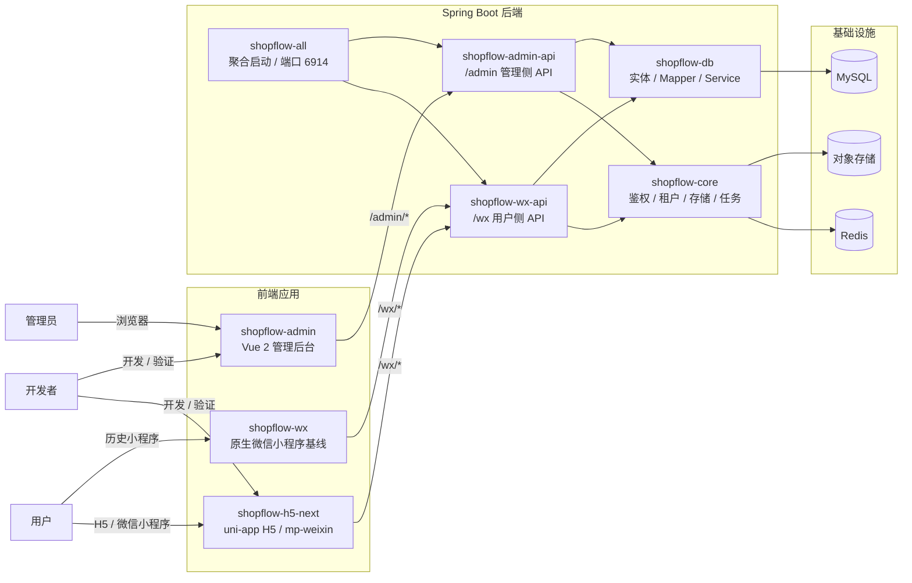
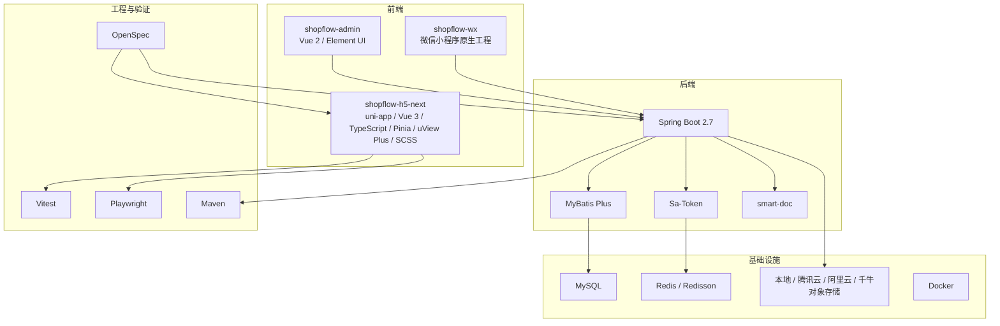
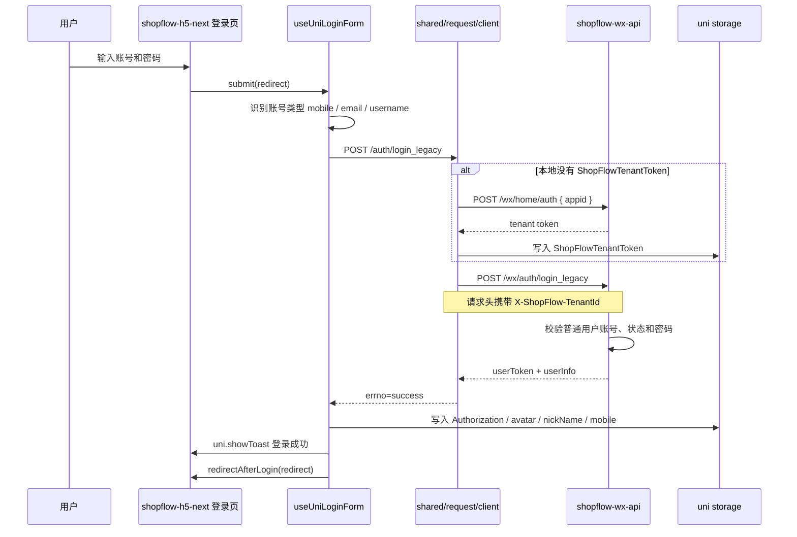

# ShopFlow

ShopFlow 是一个基于 Spring Boot、Vue、uni-app 和微信小程序生态改造的商城系统。当前项目重点已经从旧 H5 前台迁移到 `shopflow-h5-next`，目标是用一套 `uni-app` 前台同时承载 H5 和微信小程序侧的核心用户业务。

## 当前主线

- 后端统一通过 `shopflow-all` 聚合启动，默认端口 `6914`。
- 管理后台前端仍为 `shopflow-admin`，技术栈为 Vue 2 + Element UI。
- 新用户前台主工程为 `shopflow-h5-next`，技术栈为 uni-app + Vue 3 + TypeScript + Pinia + uView Plus。
- 原微信小程序 `shopflow-wx` 仍保留，作为业务行为对齐基线和切流前参照。
- 旧 H5 `shopflow-h5` 已完成下线，当前用户前台统一以 `shopflow-h5-next` 为准。

## 目录说明

| 目录 | 说明 |
| --- | --- |
| `shopflow-all` | 聚合启动模块，整合后台 API、小程序 API、核心能力和数据访问层 |
| `shopflow-admin-api` | 管理后台后端接口层 |
| `shopflow-wx-api` | 用户侧 `/wx/*` 后端接口层 |
| `shopflow-core` | 鉴权、租户、存储、通知、任务、事务等通用能力 |
| `shopflow-db` | 实体、Mapper、Service、SQL 映射和数据库脚本 |
| `shopflow-admin` | 管理后台 Vue 2 前端 |
| `shopflow-h5-next` | 当前主前台，uni-app 多端工程，可构建 H5 和微信小程序 |
| `shopflow-wx` | 原生微信小程序前端，当前主要作为业务基线保留 |
| `openspec` | 功能变更规格、设计、任务和归档 |
| `doc` | 项目文档、FAQ、设计稿和阶段计划 |

## 项目架构



当前运行形态可以理解为：

- `shopflow-all` 是本地和部署时的聚合后端入口。
- `shopflow-h5-next` 是后续用户侧主前台，一套工程产出 H5 与微信小程序。
- `shopflow-wx` 暂时保留，用来对齐业务行为和辅助验收。

## 技术栈



## 本地依赖

- JDK 8+
- Maven
- Node.js
- MySQL
- Redis
- 微信开发者工具

后端依赖本机 MySQL 与 Redis。MySQL 配置见：

`shopflow-db/src/main/resources/application-db.yml`

Redis 默认使用：

`127.0.0.1:6379`，db `0`

## 后端启动

打包：

```bash
mvn -pl shopflow-all -am -DskipTests package
```

启动：

```bash
java -jar shopflow-all/target/shopflow-all-0.1.0-exec.jar
```

验证后端 `/wx` 租户预热接口：

```bash
curl -s -X POST http://localhost:6914/wx/home/auth \
  -H 'Content-Type: application/json' \
  --data '{"appid":"1649067"}'
```

正常情况下应返回 `errno: success`，且 `data` 为租户 token 字符串。

## 管理后台启动

```bash
cd shopflow-admin
npm install
npm run dev
```

默认访问：

`http://localhost:9527`

管理后台接口默认代理到本地后端 `http://localhost:6914`。

## 新前台 H5 启动

`shopflow-h5-next` 是当前推荐使用的 H5 前台。

```bash
cd shopflow-h5-next
npm install
npm run dev:h5 -- --host 127.0.0.1 --port 6257
```

访问地址：

`http://localhost:6257/#/`

常用页面：

- 首页：`http://localhost:6257/#/`
- 个人中心：`http://localhost:6257/#/pages/user/index`
- 购物车：`http://localhost:6257/#/pages/order/cart/index`

开发环境默认配置：

- `VITE_APP_BASE_API=/wx`
- `VITE_APP_SHOPFLOW_APPID=1649067`
- Vite 代理：`/wx -> http://localhost:6914`

## 微信小程序开发包

`shopflow-h5-next` 可生成微信小程序 dev 包：

```bash
cd shopflow-h5-next
npm run dev:mp-weixin
```

生成目录：

`shopflow-h5-next/dist/dev/mp-weixin`

用微信开发者工具导入该目录即可预览。`dev:mp-weixin` 会保持 watch 模式，适合本地联调。

## 前台验证命令

在 `shopflow-h5-next` 中常用：

```bash
npm run type-check
npm run build:h5
npx vitest run
npx playwright test tests/e2e/smoke.spec.ts
```

已知情况：

- H5 构建和小程序 dev 构建可能输出 Sass `@import` / legacy JS API 弃用告警。
- 这些告警目前不阻塞构建，但后续升级 Sass 或 uView Plus 时应专项治理。

## shopflow-h5-next 登录流程留存

当前登录流程已经迁移到 `shopflow-h5-next` 的 uni-app 页面和统一请求层。H5 与小程序构建都复用同一套登录表单、租户预热和旧登录态兼容键。



关键文件：

- 登录页：`shopflow-h5-next/src/pages/login/index.vue`
- 登录表单逻辑：`shopflow-h5-next/src/features/auth/use-uni-login-form.ts`
- 登录 API：`shopflow-h5-next/src/entities/auth/api.ts`
- 请求与租户预热：`shopflow-h5-next/src/shared/request/client.ts`
- 登录态兼容：`shopflow-h5-next/src/shared/compat/session-adapter.ts`
- 登录后跳转：`shopflow-h5-next/src/shared/platform/navigation.ts`

当前兼容键：

- 用户 token：`Authorization`
- 租户 token：`ShopFlowTenantToken`
- 用户头像：`avatar`
- 用户昵称：`nickName`
- 用户手机号：`mobile`

## OpenSpec 协作规则

涉及功能新增、行为变更、接口返回结构、数据库模型、管理端页面行为、小程序交互流程或较大修复时，默认先走 OpenSpec。

推荐流程：

`brainstorming -> explore -> propose -> writing-plans -> apply -> review -> verify -> archive`

目录约定：

- 活跃变更：`openspec/changes/`
- 历史归档：`openspec/changes/archive/`
- 设计稿：`doc/superpowers/specs/`
- 实施计划：`doc/superpowers/plans/`

归档前必须确认：

- `tasks.md` 与真实实现状态一致
- change 内 spec 已同步到正式 `openspec/specs/*`
- `review.md` 已记录验证证据和残余风险
- 最新验证命令已执行并有明确结果

## 当前前台状态

`shopflow-h5-next` 已完成 uni-app 多端主工程迁移，并补齐核心交易后能力：

- 首页、商品、分类、搜索
- 登录、注册、找回密码
- 购物车、结算、支付、支付结果
- 订单列表、订单详情
- 订单评价发布
- 商品评论列表
- 售后申请、售后列表、售后详情
- H5 旧 hash 路由兼容入口

仍建议后续单独跟进的事项：

- 头像编辑
- 手机号编辑真实后端链路
- 小程序端图片选择、图片预览、上传体验专项验证
- 支付回跳小程序专项手工验证
- 用户域空态、异常态、成功态文案统一
- uView Plus / Sass 弃用告警治理

## 常用文档

- [数据库说明](./doc/database.md)
- [FAQ](./doc/FAQ.md)
- [系统架构](./doc/project.md)
- [微信小程序说明](./doc/wxmall.md)
- [管理后台说明](./doc/admin.md)
- [OpenSpec × Superpowers 项目手册](./openspec/CODEX_MANUAL.md)
- [`shopflow-h5-next` uni-app 迁移缺口清单](./doc/shopflow-h5-next-uniapp-gap-list.md)

## License

[MIT License](https://github.com/XiaoLu-lin/shopFlow/blob/main/LICENSE)

Copyright (c) 2022-present ysling
